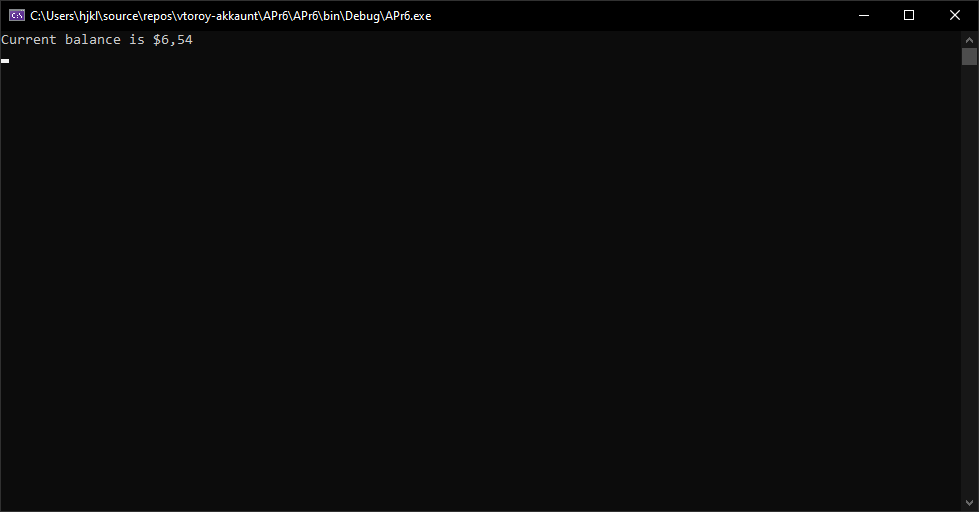
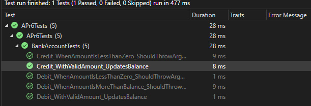

# 6-я практика

Выполнили: Писарчук, Адарченко

Работа приложения (после исправления бага):

"Обозреватель тестов":

Вывод: в ходе выполнения работы было проведено тестирование разработанных
программных модулей с использованием средств автоматизации Microsoft Visual
Studio методом "белого ящика".

Причиной успешного выполнения тестов является корректность написанного кода.
